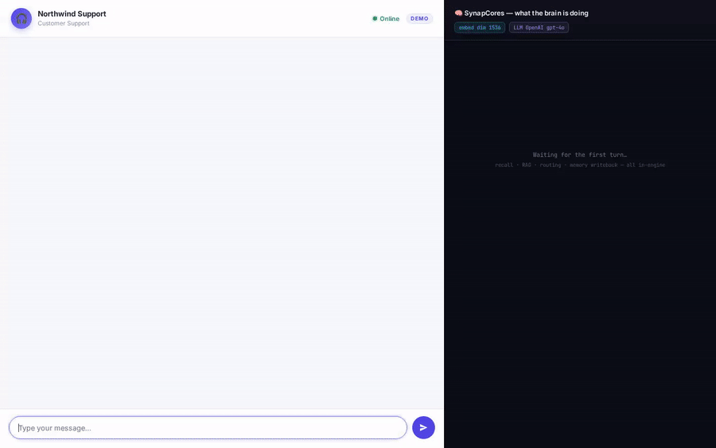

# synapcores-agent

**Embed a real, memory-grounded AI support agent on any site with one
`<script>` tag.** The widget is MIT-licensed and CDN-hosted; the agent
loop runs natively in [SynapCores](https://synapcores.com) via
`AGENT_RUN()`; your browser never holds a database credential.



```html
<script defer
  src="https://cdn.jsdelivr.net/npm/@synapcores/widget@0.4.0/dist/widget.js"
  integrity="sha384-rn44GdC0gnzNPwhJYHl4TEzahTnCGWtcE/N7QJZ1T5L+Sta8Bh/2d4lga2FaM4NB"
  crossorigin="anonymous"
  data-api-base="https://chat.your.com"
  data-project-key="pk_abc123"></script>
```

That's the entire install on the embedder's side. The two `data-*`
attributes point at **your** `@synapcores/widget-proxy` (this repo's
`proxy/`), which holds the SynapCores credential and pipes
`AiChatWsMessage` frames between the browser and a SynapCores instance
you own.

---

## What's in this repo

```
synapcores-agent/
├── widget/    @synapcores/widget   — TypeScript bundle (21 KB), on npm
├── proxy/     @synapcores/widget-proxy — Node.js delivery + WS proxy
├── examples/  Bare HTML, Next.js, WordPress reference embeds
└── src/       Original v1 Python agent demo (still works, see below)
```

| Piece | Role | Who runs it |
|---|---|---|
| `widget/` | The chat UI — floating launcher, panel, streaming render, ARIA, dark mode, mobile overlay | CDN (jsDelivr + unpkg + the proxy itself) |
| `proxy/` | Holds the SynapCores credential, issues HttpOnly cookies, proxies WS, injects `context.database` + identity | You (one Node 20 process per site) |
| SynapCores | The actual database + AGENT_RUN agent loop (recall memory → RAG → tool route → grounded generation) | You (one Docker container) |

The browser holds **only an HttpOnly signed session cookie**. No JWT, no
API key, no database token ever reaches JavaScript.

---

## Architecture

```
Browser                 widget-proxy (Node.js)        SynapCores gateway
─────────               ──────────────────────         ──────────────────
<script /widget.js>
  │  POST /v1/session  ─►  validate origin,
  │  {project_key}         set HttpOnly cookie,
  │                        return persona/agent_name
  │ ◄─
  │
  │  WS /ws (cookie)   ─►  verify cookie,
  │                        open upstream WS with
  │                        server-held JWT,
  │                        pipe AiChatWsMessage    ─►  AGENT_RUN in-DB
  │ ◄─ message_chunk          ◄─                       ◄─
  │ ◄─ message_complete       ◄─                       ◄─
```

The proxy is a credentialed pipe + a tiny session ledger. The
`AGENT_RUN()` SQL function inside SynapCores does the full agent loop
(recall memory + RAG + tool routing + grounded generation) — see
<https://synapcores.com/recipes/agents/>.

---

## Full install — one site, three components

### 1. Run SynapCores

```bash
docker run -d --name synapcores -p 8080:8080 \
  -e AIDB_ACCEPT_LICENSE=1 \
  -e AIDB_JWT_SECRET="$(openssl rand -base64 32)" \
  -v synapcores-data:/var/lib/synapcores \
  ghcr.io/synapcores/community:latest

# Grab the one-time admin credentials printed on first boot:
docker logs synapcores | grep -A 12 FIRST-BOOT
```

The Community image ships an embedded LLM (small GGUF model) + embeddings
out of the box. First call cold-starts in ~30s; subsequent calls are
sub-second. To use a hosted LLM instead, see the gateway docs for the
`[ai_chat]` config block.

### 2. Run the widget-proxy

```bash
git clone https://github.com/SynapCores/synapcores-agent
cd synapcores-agent/proxy
npm install

# Obtain a JWT for the proxy to hold:
curl -s http://localhost:8080/v1/auth/login \
  -H 'content-type: application/json' \
  -d '{"email":"admin@local","password":"<from-docker-logs>"}' \
  | python3 -c 'import json,sys;print(json.load(sys.stdin)["token"])'
# → save the printed JWT

# Configure
cp projects.example.json projects.json
# Edit projects.json: set `allowed_origins` for your sites, then run:

export PROXY_SESSION_SECRET="$(openssl rand -hex 32)"
export DEMO_SYNAPCORES_TOKEN="<paste the JWT>"

npm start         # listens on 127.0.0.1:5060
```

Visit <http://127.0.0.1:5060/> — the proxy ships a built-in dev landing
page that script-tags the widget against the first configured project,
so you can sanity-check the whole pipeline before going live.

For production, build and run with the included Dockerfile + compose:

```bash
cp docker-compose.example.yml docker-compose.yml
docker compose up -d        # SynapCores + widget-proxy together
```

### 3. Paste the widget on your site

Pick one source — both are free, both serve the identical 21 KB bundle:

**A. CDN (recommended, version-pinned + SRI):**
```html
<script defer
  src="https://cdn.jsdelivr.net/npm/@synapcores/widget@0.4.0/dist/widget.js"
  integrity="sha384-rn44GdC0gnzNPwhJYHl4TEzahTnCGWtcE/N7QJZ1T5L+Sta8Bh/2d4lga2FaM4NB"
  crossorigin="anonymous"
  data-api-base="https://chat.your.com"
  data-project-key="pk_abc123"></script>
```

**B. Proxy-hosted (no external CDN dependency):**
```html
<script defer
  src="https://chat.your.com/widget.js"
  data-api-base="https://chat.your.com"
  data-project-key="pk_abc123"></script>
```

Three reference embeds in `examples/`:

- `examples/embed-html/`     — bare HTML, Webflow, Carrd, static sites
- `examples/embed-nextjs/`   — Next.js (Script tag + React component patterns)
- `examples/embed-wordpress/` — drop-in WordPress plugin (Settings page)

---

## What the widget does

- Floating launcher button → 380×600 slide-up chat panel (full-screen
  overlay below 480px)
- Light / dark / `prefers-color-scheme: auto`, primary-color theming
- Streaming token render via `message_chunk` → markdown re-render on
  `message_complete`
- Exponential-backoff WebSocket reconnect (1s, 2s, 4s, 8s, 16s, cap 30s)
- ARIA `role="dialog"` + focus trap + ESC-to-close, `prefers-reduced-motion`
  respected
- **Persistent conversation across page loads** — deterministic session_id
  (HMAC of proxy secret + visitor + project) means returning visitors see
  their prior turns, and AGENT_RUN's chat-memory layer threads context
  across days
- **`SynapCores.identify({id, name, email, attrs})`** — when the host site
  knows who the visitor is (after login), it identifies them; the proxy
  injects identity into `send_message.context.user` server-side so
  AGENT_RUN sees an identified visitor

Full surface: see [`widget/README.md`](widget/README.md).

## What the proxy does

- Serves the widget bundle at `GET /widget.js` (ETag + 5-min cache)
- Issues HMAC-signed HttpOnly cookies at `POST /v1/session`
- Authenticates WS upgrades on `GET /ws` via the cookie + a per-project
  origin allowlist
- Pipes `AiChatWsMessage` frames; **only** `send_message` + `ping` from
  browser; `execute_sql` / `execute_tool` silently dropped
- Server-side injection of `context.database`, `context.visitor_id`,
  `context.user` (no client-side override possible)
- Per-visitor sliding-window rate limit (default 60/min/project)
- Persistent conversation history via `GET /v1/history` (proxies to
  SynapCores's `/v1/chat/sessions/{id}/messages`)
- Tiny CLI — `sc-widget projects ls | embed <key> | verify-config`

Full surface: see [`proxy/README.md`](proxy/README.md).

---

## Distribution

| Where | URL | Cost |
|---|---|---|
| npm | `@synapcores/widget` | Free, public |
| jsDelivr | `https://cdn.jsdelivr.net/npm/@synapcores/widget@0.4.0/dist/widget.js` | Free, global edge |
| unpkg | `https://unpkg.com/@synapcores/widget@0.4.0/dist/widget.js` | Free, global edge |
| Your proxy | `https://chat.your.com/widget.js` | Whatever your proxy host costs |
| Cloudflare Pages | `https://cdn.synapcores.com/widget.js` (optional CNAME) | Free tier — unlimited bandwidth |

Publishing pipeline is wired in `.github/workflows/widget-cdn.yml`:
- **Master push touching widget/** → Cloudflare Pages deploy
- **`widget-v*` tag push** → `npm publish`

See [`widget/PUBLISH.md`](widget/PUBLISH.md) for the operator guide.

---

## Also included: the v1 Python agent demo

The original v1 of this repo was a **framework-free Python agent loop**
(`src/synapcores_agent/`) that exercises the same brain (recall + RAG +
semantic routing + grounded generation) from a CLI / WebSocket demo —
the engine behind the `support-chat.gif` at the top.

The widget is not a replacement: it's a delivery surface. The Python
agent is still the cleanest way to see the loop step-by-step and to
fork as a starting point for non-browser agents (CLI tools, Discord
bots, internal pipelines).

```bash
# v1 Python agent — separate from the widget/proxy stack
git clone https://github.com/SynapCores/synapcores-agent
cd synapcores-agent
cp .env.example .env
# edit .env: SYNAPCORES_URL + admin credentials
pip install -e .

python -m synapcores_agent --seed --trace
python -m synapcores_agent --ask "I can't log in"
```

The full v1 agent loop, certified recipes, tool surface, and test suite
are documented under <https://synapcores.com/recipes/agents/>. Source
under `src/synapcores_agent/`.

---

## Repository layout

```
synapcores-agent/
├── .github/workflows/widget-cdn.yml   Cloudflare Pages + npm publish
├── widget/
│   ├── src/         TypeScript widget bundle source
│   ├── dist/        Built artifact (committed for the proxy to serve)
│   ├── PUBLISH.md   How publishing works (Cloudflare + npm)
│   └── README.md    Widget config + dev surface
├── proxy/
│   ├── src/         Node.js HTTP + WS proxy
│   ├── bin/         sc-widget CLI
│   ├── Dockerfile, docker-compose.example.yml
│   └── README.md    Proxy config + security checklist + deploy
├── examples/
│   ├── embed-html/, embed-nextjs/, embed-wordpress/
│   └── README.md    Embed patterns
└── src/synapcores_agent/   v1 Python agent (original demo)
```

---

## Status

| Component | Status |
|---|---|
| `@synapcores/widget@0.4.0` | ✅ Live on npm, jsDelivr, unpkg |
| `@synapcores/widget-proxy` (this repo's `proxy/`) | ✅ Sprint 2-4 complete |
| identify() + persistent conversation | ✅ Sprint 3 |
| Dockerfile + docker-compose | ✅ Sprint 4 |
| Cloudflare Pages auto-deploy | ⚠️ Workflow present, awaiting secrets |
| v1 Python agent demo | ✅ Unchanged from May |

---

## License

MIT — see [LICENSE](LICENSE).

Built on [SynapCores](https://synapcores.com). The agentic patterns are
the certified recipes at <https://synapcores.com/recipes/agents/>.
