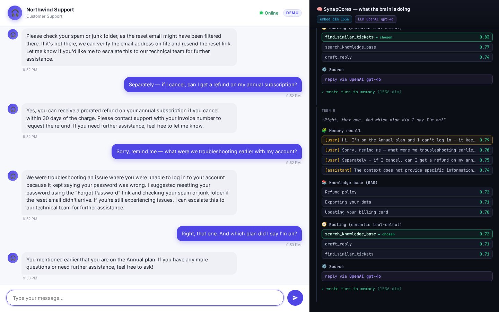

# Recorded demos — SynapCores customer-support agent

Two real, end-to-end recordings against a live SynapCores gateway. In both, the
**memory + retrieval (RAG) + tool-routing all run in the engine** as real
vector SQL; the language model that writes the words is **pluggable** and
swappable (here, OpenAI `gpt-4o`; with zero external keys the bundled
`GENERATE` produces the reply on the same agent code).

## 1) Customer-service chat widget (primary)

**`support-chat.mp4`** / **`support-chat.gif`** — a polished, production-style
**browser chat widget** with a live "Brain" debug sidebar. This is the launch
demo: it looks like a real Intercom/Zendesk support chatbot, but you can
*watch* the database doing the thinking on the right.



What's on screen:

- **Left pane — the chat widget.** Branded header ("Northwind Support",
  headset avatar, green "Online" status, "DEMO" pill), agent bubbles on the
  left with the avatar, customer bubbles on the right in indigo, timestamps,
  an animated typing indicator, and a rounded composer. The customer asks
  about an Annual-plan login problem, a refund, and — the headline beat —
  *"remind me, what were we troubleshooting earlier?"*
- **Right pane — the "Brain" debug sidebar (dark).** Per turn the panel
  animates the engine doing its work: **Memory recall** (recalled lines +
  cosine scores), **Knowledge base (RAG)** (KB titles + scores), **Routing**
  (per-tool scores with the chosen tool highlighted), **Source** (the LLM
  that wrote the reply), and a `✓ wrote turn to memory` line. Two badges in
  the header show the live embedding dimensionality (`embed dim 1536` →
  OpenAI active) and the LLM in use (`LLM OpenAI gpt-4o`).

The memory beat is the point: turn 4 recalls the login issue **by meaning**
(no keyword overlap) from the memory table, and turn 5 recalls the *Annual
plan* detail from turn 1. That memory lives entirely in SynapCores.

### What's the database vs. the model

- **Memory + retrieval + routing (the cognition): SynapCores.** Real
  `EMBED()` / `COSINE_SIMILARITY()` vector SQL over `/v1/query/execute`, on
  **1536-dimensional OpenAI `text-embedding-ada-002`** vectors. The agent
  probed the live embedding model at startup and sized its vector columns to
  **1536** (vs. 384 for the bundled MiniLM) — confirming OpenAI embeddings
  were active in the engine.
- **Reply generation: OpenAI `gpt-4o`,** called directly by the agent. The
  LLM is a swappable component (`AGENT_GENERATOR=openai` →
  `synapcores_agent/llm.py`); set `AGENT_GENERATOR=engine` (or unset it)
  and the same agent runs **zero-key** on the bundled `GENERATE`.

### Artifacts

| File | What it is |
|------|------------|
| [`support-chat.mp4`](support-chat.mp4) | H.264 / yuv420p, 1440×900, ~44s — chat widget + Brain sidebar |
| [`support-chat.gif`](support-chat.gif) | 900-wide animated GIF — drop into READMEs / social |
| [`support-chat.png`](support-chat.png) | Final-scene Playwright screenshot — full transcript + full brain |

### Reproduce it

```bash
# 1) point the gateway's [query.ai_service] at OpenAI (text-embedding-ada-002),
#    OPENAI_API_KEY via --env-file. Raise request_timeout=300, default_timeout_ms=300000.
# 2) agent .env:  SYNAPCORES_URL, admin creds, AGENT_GENERATOR=openai, AGENT_LLM_MODEL=gpt-4o.
pip install -e ".[web,record]"
playwright install chromium

# OPENAI_API_KEY must be in the process environment for the gpt-4o reply step.
python -m synapcores_agent chat --port 8810      # serves http://127.0.0.1:8810/
python scripts/record_chat.py                    # produces support-chat.mp4 + .gif + .png
```

> Zero-key variant: set `[query.ai_service] provider = "native"` on the
> gateway and unset `AGENT_GENERATOR` — the agent runs end-to-end on the
> bundled embedding + GENERATE models. The widget, the Brain sidebar, and the
> memory beat all still work; only the model behind the words changes.

## 2) Terminal recording (asciinema)

**`support-session.mp4` / `.gif` / `.cast`** — the original CLI session
(`examples/record_session.py`), useful when you want a tight, narrated trace
of the brain steps in a terminal.

| File | What it is |
|------|------------|
| [`support-session.cast`](support-session.cast) | asciinema recording (replay with `asciinema play …`) |
| [`support-session.gif`](support-session.gif)   | animated GIF |
| [`support-session.mp4`](support-session.mp4)   | H.264 MP4 |

The full transcript is included below for both demos (the conversation arc is
the same): an Annual-plan login issue, a missing reset email, a refund
question, and the memory beats in turns 4 and 5.

## Full transcript (terminal session)

```text
================================================================
  SynapCores agent — live customer-support session
  brain = SynapCores  |  embeddings = OpenAI (1536-d)  |  LLM = gpt-4o
  recall (memory) + RAG (KB) + semantic tool-routing, every turn
================================================================

Seeded 5 KB articles + 4 resolved tickets into the brain.
Customer: acme-customer  |  brain probed at 1536-dim embeddings.

you> Hi, I'm on the Annual plan and I can't log in — it keeps saying my password is wrong.
     brain: recall=0 kb=3 route=[find_similar_tickets=0.80, search_knowledge_base=0.73, draft_reply=0.69] -> find_similar_tickets
     recall=0: first turn, nothing in memory yet. KB + past tickets ground the reply.
agent> I'm sorry to hear you're having trouble logging in. Please try using the 'Forgot password' link on the sign-in page to reset your password. This should help you regain access to your account. If you continue to experience issues, please let me know, and I can escalate the matter for further assistance.

you> I tried resetting it but the reset email never arrived.
     brain: recall=2 kb=3 route=[find_similar_tickets=0.77, search_knowledge_base=0.71, draft_reply=0.70] -> find_similar_tickets
     remembered [0.81] (assistant): I'm sorry to hear you're having trouble logging in. Please try resetting you...
     recall>0: pulled the login problem back from memory by meaning, not keywords.
agent> Please check your spam or junk folder, as sometimes the reset email can end up there. If you still don't see it, let me know, and I can escalate this to ensure the email address on file is correct and resend the reset link.

you> Separately — if I cancel, can I get a refund on my annual subscription?
     brain: recall=4 kb=3 route=[search_knowledge_base=0.76, find_similar_tickets=0.74, draft_reply=0.72] -> search_knowledge_base
     remembered [0.79] (user): Hi, I'm on the Annual plan and I can't log in — it keeps saying my password ...
     semantic route swings to the KB: a how-to/policy question, not an incident.
agent> If you cancel your annual subscription, you may be eligible for a prorated refund if you are within 30 days of the charge. Please contact support with your invoice number to request a refund. If you need further assistance, feel free to ask.

you> Sorry, remind me — what were we troubleshooting earlier with my account?
     brain: recall=4 kb=3 route=[find_similar_tickets=0.83, search_knowledge_base=0.77, draft_reply=0.74] -> find_similar_tickets
     remembered [0.81] (user): Hi, I'm on the Annual plan and I can't log in — it keeps saying my password ...
     THE BEAT: no keyword overlap with 'login', yet it recalls the sign-in issue from memory and grounds the answer on it.
agent> We were troubleshooting your login issue, where you were unable to sign in because it kept saying your password was wrong. I suggested resetting your password using the 'Forgot password' link on the sign-in page. If you continue to have trouble, please let me know, and I can escalate this for further assistance.

you> Right, that one. And which plan did I say I'm on?
     brain: recall=4 kb=3 route=[search_knowledge_base=0.72, draft_reply=0.71, find_similar_tickets=0.71] -> search_knowledge_base
     remembered [0.79] (user): Hi, I'm on the Annual plan and I can't log in — it keeps saying my password ...
     continuity: it remembers the Annual-plan detail from turn 1.
agent> You mentioned that you are on the Annual plan. If you have any more questions or need further assistance, feel free to ask!

================================================================
  agentic memory: it remembered across turns — by meaning.
  same agent, zero-key on the bundled model. see ../PRODUCTION.md
================================================================
```
